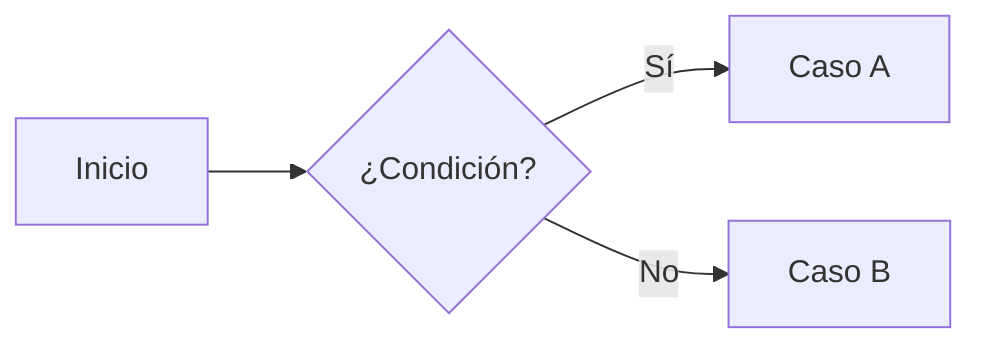

# Página de ejemplo

Esta página muestra los elementos de Markdown más comunes que vas a usar en la documentación.

## Texto y listas

Texto en **negritas**, en *cursivas* y `código en línea`.

- Punto uno
- Punto dos
  - Sub-punto

## Admonition

!!! note "Nota"
    Esto es un bloque de nota.

!!! warning "Advertencia"
    Esto es un bloque de advertencia.

## Tabla

| Campo   | Tipo   | Descripción       |
|---------|--------|--------------------|
| Id      | int    | Identificador      |
| Nombre  | string | Nombre visible     |

## Bloque de código

```csharp
public class Ejemplo
{
    public int Id { get; set; }
}
```

## Diagrama (mermaid)


